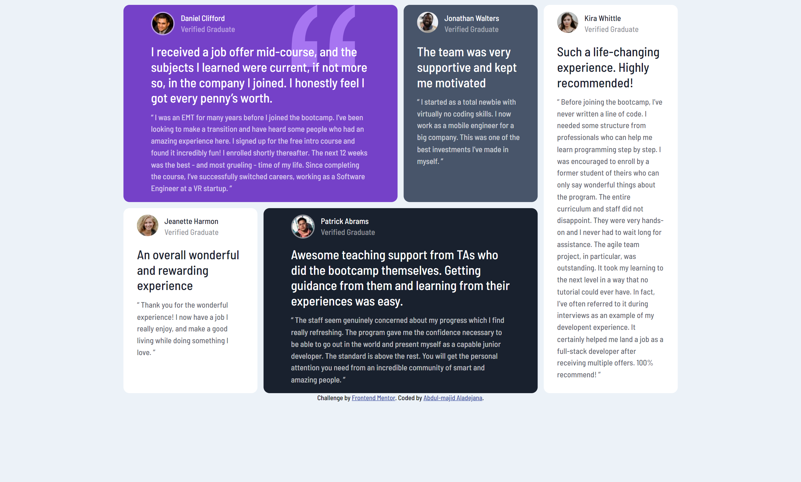

# Frontend Mentor - Testimonials grid section solution

This is a solution to the [Testimonials grid section challenge on Frontend Mentor](https://www.frontendmentor.io/challenges/testimonials-grid-section-Nnw6J7Un7). Frontend Mentor challenges help you improve your coding skills by building realistic projects.

## Table of contents

- [Overview](#overview)
  - [Screenshot](#screenshot)
  - [Links](#links)
  - [Built with](#built-with)
  - [What I learned](#what-i-learned)
  - [Useful resources](#useful-resources)
- [Author](#author)

## Overview

Project Name: **Testimonials grid section**

Date: 11-09-2023

### Screenshot



### Links

- Solution URL: [Github](https://github.com/Abdulmajid48/testimonials)
- Live Site URL: [Github](https://abdulmajid48.github.io/testimonials/)

### Built with

- Semantic HTML5 markup
- CSS custom properties
- Grid Layout
- Google fonts
- Media Query

### What I learned

Using grid layout has been a valuable learning experience for me. One of the key takeaways is the power of visual organization. Grid layouts provide a structured framework for arranging content, whether it's for web design, or even personal organization. This structure helps information become more digestible and accessible, making it easier for users to navigate and understand. I've realized that a well-designed grid can greatly enhance the user experience by creating a sense of order and consistency.

```css
@media (min-width: 376px) and (max-width: 1440px) {
  .container {
    display: grid;
    grid-template-columns: 1fr 1fr 1fr 1fr;
    grid-template-rows: 0.8fr 0.8fr;
    gap: 10px;
    width: 70%;
    margin: auto;
  }

  .div1,
  .div5 {
    grid-column: span 2;
  }
  .div3 {
    grid-row: span 2;
  }
}
```

### Useful resources

- [Google Fonts](https://fonts.google.com) - This simplifies the process of adding fonts to code.

## Author

- [Hasnode](https://abdulmajid.hashnode.dev)
- [Frontendmentor](https://www.frontendmentor.io/profile/Abdulmajid48)
- [Twitter](https://www.twitter.com/aladejanaamajid)
